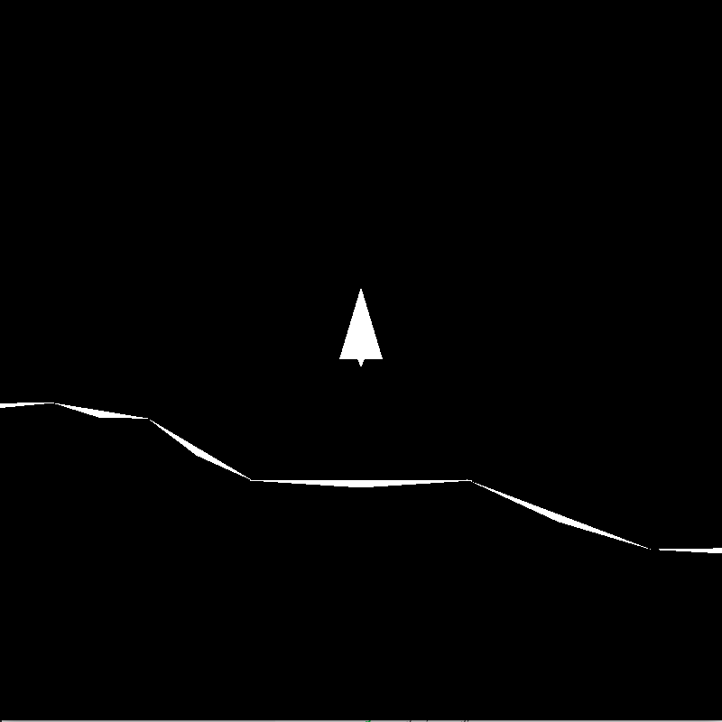

Lander
======

Lander mini game implemented using Rust and WebGPU.

Controls
--------

 * Left arrow key - activates left booster
 * Right arrow key - activates right booster
 * Up arrow key - activates central booster

Steer the space ship by using the lateral boosters to change the direction the ship is pointing. Use the central booster to move forward.